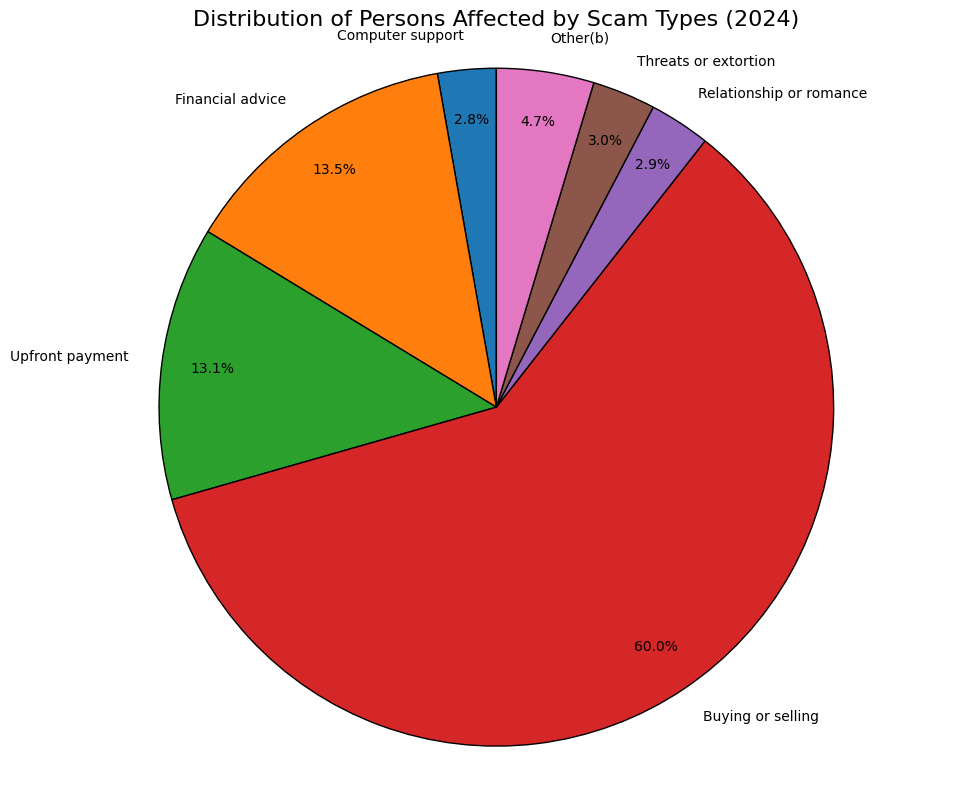
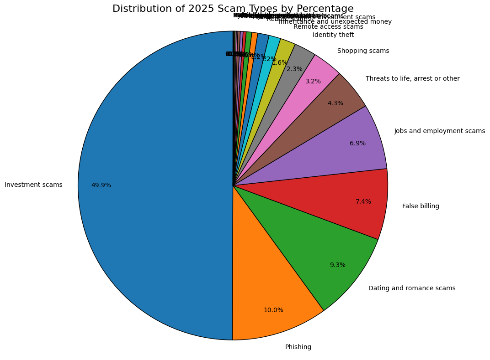

# lsjm-scam-platform

Let Scams Just Miss (LSJM) is an explainable AI platform that evaluates scam risks in messages and URLs.  
It generates risk scores, identifies suspicious signals, and provides clear explanations and safer action suggestions to help users avoid potential scams.

Detect scams. Understand the risk. Stay safe online.

---

## Table of Contents

- [Problem](#problem)
- [Solution](#solution)
- [How It Works](#how-it-works)
- [System Architecture](#system-architecture)
- [Example Analysis Result](#example-analysis-result)
- [Tech Stack](#tech-stack)
- [Project Structure](#project-structure)
- [Setup](#setup)
- [API](#api)
- [Path Conventions](#path-conventions)
- [Multilingual Rule Schema](#multilingual-rule-schema)
- [Team](#team)
- [Documentation & Implementation Plans](#documentation--implementation-plans)
  - [KAN-39 Shieldy Plan](#kan-39-shieldy-plan)
  - [LLM Frontend Integration Plan](#llm-frontend-integration-plan)
  - [Frontend LLM Output Design](#frontend-llm-output-design)
  - [Extension Proactive + Combined Report + Risk Redirect Plan](#extension-proactive--combined-report--risk-redirect-plan)

---

## Problem

Online scams are increasing rapidly, especially with the rise of AI-generated content, phishing messages, and fake websites.  
Many users struggle to recognize suspicious content while browsing, clicking links, or reading messages.

Current solutions often:
- only block known scam websites
- lack explanations for why something is dangerous
- fail to detect newly generated scam content

Users need a system that can **analyze content in real time and explain potential scam risks clearly**.




---

## Solution

LSJM provides an explainable scam risk detection platform.

The system analyzes messages and URLs, identifies suspicious patterns, and generates a **risk score** with explanations.

Key features:

Instead of simply flagging content, LSJM explains **why something may be risky**, helping users make safer decisions.

---

## How It Works

1. A user submits a message or URL.
2. The system extracts relevant text content.
3. The backend analyzes the content using detection rules and AI-assisted evaluation.
4. Suspicious signals are identified.
5. A risk score and explanation are generated.
6. The user receives a clear warning and recommended actions.

---

## System Architecture

The platform consists of several components:

**Frontend / Client**
- Web interface and browser extension
- Collects messages, URLs, or webpage content from users

**Backend Service**
- Node.js + Express API
- Handles analysis requests from the frontend and extension

**Detection Engine**
- Rule-based scam pattern detection
- AI-assisted content evaluation

**Result Builder**
- Generates a unified risk report
- Provides explanations and advice

### Data Flow

User Input  
→ Content Extraction  
→ Backend Analysis  
→ Signal Detection  
→ Risk Score Generation  
→ Result Explanation

---

## Example Analysis Result

Example API response:

```json
{
  "riskScore": 82,
  "riskLevel": "high",
  "signals": [
    "urgent request"
  ],
  "reasons": [
    "The message asks the user to act urgently."
  ],
  "advice": [
    "Do not click suspicious links."
  ]
}
```

---

## Tech Stack

**Backend**
- Node.js + TypeScript + Express
- pnpm (workspace)

---

## Project Structure

```
lsjm-scam-platform/
├── backend/                 # Node + Express API (serves frontend)
│   ├── src/
│   ├── package.json
│   └── tsconfig.json
├── frontend/                # Web UI (HTML, CSS, JS)
│   ├── index.html
│   ├── css/
│   └── js/
├── extension/               # Chrome extension
│   ├── manifest.json
│   ├── popup.html
│   ├── popup.js
│   ├── content.js
│   ├── shared-ui.css       # Copied from shared (run pnpm copy-shared)
│   └── styles.css
├── shared/
│   └── css/
│       └── ui.css          # Shared UI tokens, risk levels, states
├── docs/                    # Plans and design docs (content merged here)
├── package.json
├── pnpm-workspace.yaml
└── .env.example
```

---

## Setup

**Prerequisites:** Node.js >= 18, pnpm

```bash
# Install dependencies
pnpm install

# Backend
pnpm backend:dev      # Development server
pnpm backend:build    # Build (compile + copy rules)
pnpm backend:start    # Run production build
```

Copy `.env.example` to `.env` and adjust if needed. Default port: 3000.

Open http://localhost:3000 for the web interface.

**Chrome Extension:** Load `extension/` as an unpacked extension in Chrome (chrome://extensions → Developer mode → Load unpacked). After changing `shared/css/ui.css`, run `pnpm copy-shared` to update `extension/shared-ui.css`.

### Shared UI (KAN-38)

- **`shared/css/ui.css`** — Source of truth for risk level colors, loading/error/success states. Used by web and extension.
- **`pnpm copy-shared`** — Copies shared UI to `extension/shared-ui.css` (extension cannot load files outside its folder).

### LLM (Qwen) Environment

For hybrid/LLM text analysis, set in `backend/.env`:

```env
DASHSCOPE_API_KEY=...
DASHSCOPE_BASE_URL=https://dashscope-us.aliyuncs.com/compatible-mode/v1
QWEN_MODEL=qwen-plus
```

If not set, text analysis falls back to rule-only mode.

---

## API

| Method | Path | Description |
|--------|------|-------------|
| GET | `/health` | Health check |
| POST | `/analyze-text` | Text analysis (supports `?mode=hybrid\|llm\|rule`) |
| POST | `/analyze-url` | URL analysis |
| POST | `/analyze-page` | Combined text + URL analysis (returns `{ text, url }`) |

### Mock / Fallback (KAN-25)

- **Mock mode**: Add `?mock=1` to any analyze request, or set `LSJM_MOCK_MODE=1` for global mock. Returns stable low-risk responses for demos.
- **Fallback on error**: If analysis throws, the API returns a structured fallback result (riskScore 50, medium) instead of 5xx, keeping the API stable.

---

## Path Conventions

- **Imports:** `@/types/analysisTypes`, `@/analysis/textAnalyzer`, etc. (via `baseUrl` and `paths` in tsconfig)
- **File system:** `resolvePath()` in `utils/paths.ts` for loading rules; rules are copied to `dist/rules/` during build

---

## Multilingual Rule Schema

Rule configuration for scam signal detection. Supports English (en), Chinese (zh), Spanish (es), French (fr) for input matching; outputs (reasons, advice) in English.

### signals.json

Each signal: `id`, `description`, `keywords` (per language), `weight`.

| Field       | Type   | Description                    |
|-------------|--------|--------------------------------|
| id          | string | Unique signal identifier       |
| description | string | Short English description      |
| keywords    | object | Language key → string[]        |
| weight      | number | Score contribution (0–100)     |

### reasonTemplates.json / adviceTemplates.json

Maps signal id to multilingual reason/advice text. Structure: `{ "signal_id": { "en": "...", "zh": "...", "es": "...", "fr": "..." } }`.

### weights.json

Default weight ranges and per-signal overrides.

---

## Team

Let Shade Just Move:

- Xingzhi Li (Icey)
- Ting Shen (Lena)
- Guangyu Ma (Marcus)
- Xiaohan Jiang (Lindsey)

University of New South Wales

---

# Documentation & Implementation Plans

The following sections are merged from `docs/` for a single reference. Original files: `KAN-39-Shieldy-Plan.md`, `KAN-LLM-Frontend-Integration-Plan.md`, `Frontend-LLM-Output-Design.md`, `Extension-Proactive-Combined-Report-Plan.md`.

---

## KAN-39 Shieldy Plan

### Reference

4 pixel-art robot states (2×2 grid):
- **Calm**: Silver robot on green leaf, sleeping (Z's), relaxed
- **Suspicious**: Silver robot standing, magnifying glass, question mark
- **Alert**: Silver robot, exclamation mark, warning sign, wide eyes
- **Danger**: Red robot, shield, fist, jagged sparks

### Asset Strategy (implemented)

- **Source**: `shared/images/shieldy-sprite.png` (2×2 grid: Calm, Suspicious, Alert, Danger)
- **Split**: `node scripts/split-shieldy-sprite.mjs` → 4 PNGs
- **Process**: `pnpm shieldy:process` → 去白底、裁掉底部文字标签，只保留角色
- **Web**: img `src="/shared/images/shieldy-"+state+".png"`
- **Extension**: `pnpm copy-shared` copies the 4 PNGs to `extension/images/`; img `src="images/shieldy-"+state+".png"`

### State Mapping

| risk_level | Shieldy state |
|------------|---------------|
| low        | calm          |
| medium     | suspicious    |
| high       | alert         |
| critical   | danger        |

### Animations

| State      | Animation                          | Implementation |
|------------|------------------------------------|----------------|
| **Calm**   | Subtle breathing (up/down)         | `transform: translateY()` keyframes |
| **Calm**   | Snot bubble appear/disappear       | `::after` pseudo, `opacity` 0↔1, 2–3s cycle |
| **Suspicious** | Idle bounce, slight left–right sway | `translateY` + `rotate(±2deg)` |
| **Alert**  | Jump / bounce                      | `translateY` 0 → -6px → 0 |
| **Alert**  | Exclamation pulse (optional)       | `scale` or `opacity` on icon overlay |
| **Danger** | Shake left–right                   | `translateX` ±3px |
| **Danger** | Sparks flicker (optional)          | Extra div with `opacity` keyframes |

### Structure

```
.shieldy-wrapper
  .shieldy.shieldy-{state}     ← sprite or img
  .shieldy-bubble (calm only)  ← ::after or extra span
  .shieldy-label               ← "Calm" | "Suspicious" | "Alert" | "Danger"
```

### Integration Points

- **Web**: Above risk header in result card, or left of risk badge
- **Extension**: Compact version, above risk header in result card

### Implementation Order

1. Create/crop sprite assets from reference
2. Add `shared/css/shieldy.css` (or in ui.css)
3. Add Shieldy HTML + state logic to web `renderResultCard`
4. Add Shieldy to extension `renderResultCard`
5. Add animations per state
6. Add snot bubble for Calm

---

## LLM Frontend Integration Plan

### Current State Summary

| Component | Status | Notes |
|-----------|--------|-------|
| **Backend LLM** | ✅ Implemented | `qwenTextAnalyzer.ts` + `combineTextAnalyzer.ts` (rule 25% + semantic 75%) |
| **analyzeText route** | ✅ Using LLM | Uses `analyzeTextHybrid` with fallback to rule-only |
| **analyzeUrl route** | Rule-only | URL structure + WHOIS; no page content |
| **Frontend (web)** | ✅ Ready | Calls `POST /analyze-text`, renders `AnalysisResult` |
| **Extension** | ✅ Ready | Same API, extracts page text via `getPageText` |
| **Skill / System prompt** | ✅ Done | Explicit "skill" definition in `qwenTextAnalyzer` |

### Phase 1: Wire LLM to Text Analysis (Critical Path) — Done

**Goal:** Make the existing hybrid LLM analyzer the default for text analysis so frontend and extension get LLM-enriched results.

- **Route**: `analyzeText` uses `analyzeTextHybrid` from `combineTextAnalyzer`.
- **Fallback**: If LLM fails (e.g. API key missing), fall back to rule-only `analyzeText` or `getTextFallback`.
- **Verification**: With `DASHSCOPE_API_KEY`, signals include `llm_*` and reasons include Qwen explanation; without key, fallback works.

### Phase 2: Skill Prompt Enhancement — Done

**Goal:** Explicitly define LLM "skill" and responsibilities.

- **File:** `backend/src/analysis/qwenTextAnalyzer.ts`
- **Skill block:** "Scam & Phishing Text Analyst" — detect impersonation, urgency, credential/payment requests, reward lures, official-channel bypass; output strict JSON; confidence 0–1.

### Phase 3: Full LLM Mode (100% Semantic) — Done

**Goal:** Support "full LLM" mode where score and signals come purely from LLM.

- **`analyzeTextLLMOnly`** in `combineTextAnalyzer.ts`.
- **Query parameter:** `POST /analyze-text?mode=hybrid` (default), `?mode=llm`, `?mode=rule`.
- **Frontend:** Optional mode toggle or dev option via query param.

### Phase 4: URL + Page Content LLM Analysis (Future)

**Goal:** When user submits a URL, optionally fetch page content and run LLM on it.

- **Flow A (recommended):** Extension sends URL + extracted text; backend uses same text analysis.
- **Flow B:** Backend fetches URL, extracts text (e.g. cheerio), runs `analyzeTextHybrid(extractedText)` and combines with URL-structure signals.

### Implementation Order

| Step | Task | Status |
|------|------|--------|
| 1 | Wire `analyzeTextHybrid` to `/analyze-text` route | ✅ Done |
| 2 | Add LLM failure fallback to rule-only | ✅ Done |
| 3 | Skill prompt enhancement in `qwenTextAnalyzer` | ✅ Done |
| 4 | Add `analyzeTextLLMOnly` + `?mode=llm` support | ✅ Done |
| 5 | Frontend mode selector (web + extension) | ✅ Done |
| 6 | (Future) URL + page text via extension | Pending |

### Environment

```env
DASHSCOPE_API_KEY=...
DASHSCOPE_BASE_URL=...
QWEN_MODEL=qwen-plus
```

### Testing Checklist

- [ ] Text analysis returns LLM signals (`llm_impersonation`, `llm_urgency`, etc.) and Qwen `reason`.
- [ ] Risk level and score align with LLM output (hybrid mode).
- [ ] `?mode=llm` returns 100% LLM-derived result.
- [ ] `?mode=rule` returns rule-only (no LLM call).
- [ ] Without API key, fallback to rule-only succeeds.
- [ ] Extension popup: "Get page text" → Analyze shows LLM-enriched result.

---

## Frontend LLM Output Design

### Current Mapping

**LLM Raw Output (QwenSemanticResult)**

| Field | Type | Description |
|-------|------|-------------|
| `label` | phishing \| suspicious \| benign | Semantic classification |
| `confidence` | 0–1 | Confidence score |
| `impersonation` | boolean | Impersonation of trusted entity |
| `urgency_pressure` | boolean | Urgency or pressure tactics |
| `credential_request` | boolean | Request for credentials |
| `payment_request` | boolean | Request for payment |
| `external_link_action` | boolean | Suspicious link or external action |
| `threat_language` | boolean | Threatening language |
| `official_channel_bypass` | boolean | Bypass of official channels |
| `reward_lure` | boolean | Reward, refund or lure pattern |
| `scam_type` | string | Scam type label |
| `signals` | string[] | Short phrases extracted by LLM |
| `reason` | string | Explanation |

**Current API (AnalysisResult)**

| Field | Source |
|-------|--------|
| riskScore | Rule + LLM computation |
| riskLevel | low/medium/high/critical |
| signals | RiskSignal[] (includes llm_* descriptions) |
| reasons | string[] (includes qwenResult.reason) |
| advice | string[] |

**Information Not Passed to Frontend (today)**

| LLM Field | Passed? |
|-----------|--------|
| label | ❌ Only mapped to riskLevel |
| confidence | ❌ Not displayed |
| 8 indicator booleans | ❌ Flattened into signals |
| scam_type | ❌ Not passed |
| signals (LLM phrases) | ❌ Not shown separately |

### Design Goals

Redesign the frontend output structure so users clearly see:

1. LLM overall judgment (label + confidence)
2. Detected risk dimensions (8 indicator categories)
3. Scam type (scam_type)
4. LLM evidence items (signals)
5. Comprehensive explanation (reason)

### Option A: Extend API, Frontend Renders by LLM Structure (Recommended)

- **Extend AnalysisResult** with `llmDetails?: LLMDetails` where `LLMDetails` includes `label`, `confidence`, `indicators` (8 booleans), `scamType`, `rawSignals`, `reason`.
- **Backend:** `combineTextAnalyzer` fills `llmDetails` in hybrid/llm modes.
- **Frontend:** When `llmDetails` exists, render "Detected indicators / Scam type / LLM explanation / Evidence / Advice"; rule-only keeps current three-block layout.
- **Extension:** Mirror same structure.

### Option B: Minimal Change

- Group signals: `llm_*` under "LLM detected", others under "Rule detected".
- Group reasons: first containing "Qwen detected" as "LLM explanation".
- Add scamType in reasons or a signal (no API change). Cons: confidence, label not shown directly.

### Display Copy for 8 Indicator Categories

| id | Frontend display copy |
|----|------------------------|
| llm_impersonation | Impersonation of trusted entity |
| llm_urgency | Urgency or pressure language |
| llm_credential_request | Request for credentials or verification |
| llm_payment_request | Payment or transfer request |
| llm_external_link | Suspicious link or external action |
| llm_threat_language | Threatening or fear-based language |
| llm_official_channel_bypass | Bypass of official channels |
| llm_reward_lure | Reward, prize, refund or lure pattern |

---

## Extension Proactive + Combined Report + Risk Redirect Plan

### Goals and Scope

- **Extension**: User enables "page risk detection"; extension listens for navigations, auto-fetches URL + body text, runs combined "text + URL" analysis, produces **one combined report**; if risk exceeds thresholds, redirects to a **risk warning page**.
- **Web**: Demo/testing; one "Analyze together" button, same combined API and report; no auto-listen or redirect.

### Extension: Listeners and Events

**Enable switch**

- Master switch "Enable page risk detection" in popup; persist in `chrome.storage.local` as `lsjm_auto_analyze_enabled`.
- Only when true, run "on every navigation" logic.

**On each page navigation**

- Listen: `chrome.tabs.onUpdated` for `status === 'complete'`.
- Data: current tab **URL**; then `chrome.tabs.sendMessage(tabId, { action: 'getPageText' })` for **page body text**.
- Trigger: one combined analysis request (see backend).

**Debounce / throttle**

- Same tab: trigger at most once within 2–3 seconds (SPA). Optional: dedupe by URL within 5 minutes.

### One Button: Text + URL Together

**Extension popup**

- Single button: "Analyze current page". On click: get URL + page text → call combined API → show one combined report (text score, URL score, summary; redirect logic applies).

**Web**

- Separate Text / URL inputs, one button "Analyze together". Send both to combined API; render same combined report structure.

### Backend: Combined Analysis API and Two Scores

**Two scores (not merged)**

- **Text score**: Rule 25% + LLM 75% hybrid → `textScore` (0–100), `textRiskLevel`, signals/reasons/advice.
- **URL score**: Existing URL analysis (no LLM) → `urlScore`, `urlRiskLevel`, signals/reasons/advice.
- Return **both**; frontend displays both and decides redirect.

**Response shape**

```ts
{
  text: { riskScore, riskLevel, signals, reasons, advice },
  url:  { riskScore, riskLevel, signals, reasons, advice }
}
```

**API**

- **POST /analyze-page** — Body: `{ text: string, url: string }`. Runs text (hybrid) and URL analysis in parallel; returns `{ text, url }`.

### Auto-Redirect: When and Where

**Conditions (redirect if any is true)**

- **Text**: `textScore >= 67`
- **URL**: `urlScore > 25`
- **Total**: `(textScore + urlScore) > 75` (i.e. sum ≥ 76)

**Action**

- Extension: `chrome.tabs.update(tabId, { url: extension warning page })` e.g. `chrome-extension://<id>/warning.html?ts=...&us=...`.

**Warning page**

- Single screen: "This page/link has elevated risk"; show text + URL scores/levels; one line of advice; "Go back" button (`history.back()` or referrer).

### Score Summary

| Dimension   | Source                    | LLM? | Use |
|------------|---------------------------|------|-----|
| Text score | Rule 25% + LLM 75%        | Yes  | Combined report + redirect if ≥67 |
| URL score  | Existing URL rules only  | No   | Combined report + redirect if >25 |

Redirect rule: `(textScore >= 67) || (urlScore > 25) || (textScore + urlScore > 75)` → open warning page.

**Extension display:** The extension popup does **not** show numeric scores; it shows only **risk level** (Low / Medium / High / Critical) and explanation content (Signals, Reasons, Advice). The web frontend continues to show full scores and levels.

### Implementation Order

1. **Branch**: `feature/extension-auto-analyze-combined-warning` (or current feature branch).
2. **Backend**: Add `POST /analyze-page`, return `{ text, url }`.
3. **Extension**: Enable switch + storage; tab load listener (debounce); popup "Analyze current page" + combined report; redirect to `warning.html` when thresholds met.
4. **Extension**: Add `warning.html` + minimal styles/script.
5. **Web**: One "Analyze together" button, same API and report for demo.

### Config (can move to options later)

- Text redirect threshold: 67.
- URL redirect threshold: 25.
- Total (sum) redirect threshold: > 75 (i.e. sum ≥ 76).
- Auto-redirect on/off: optional alongside "Enable page risk detection".
